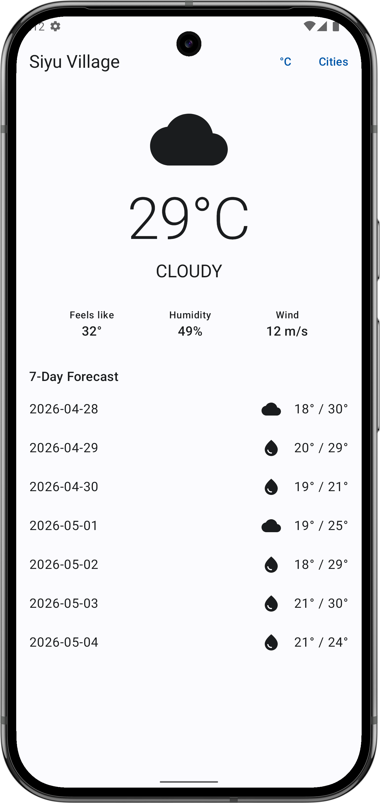
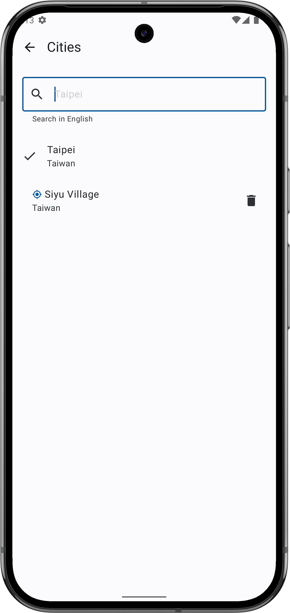
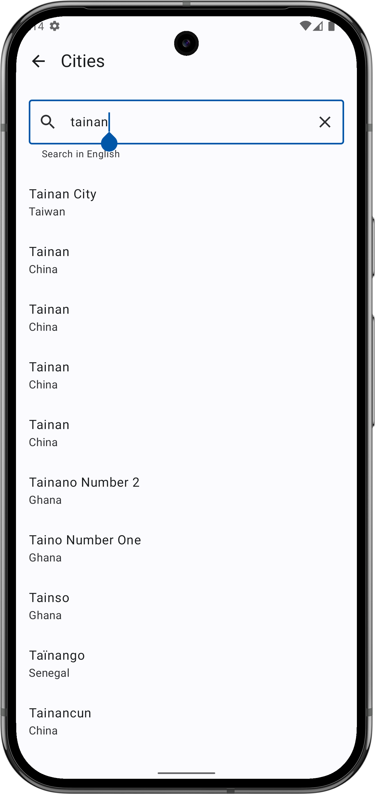
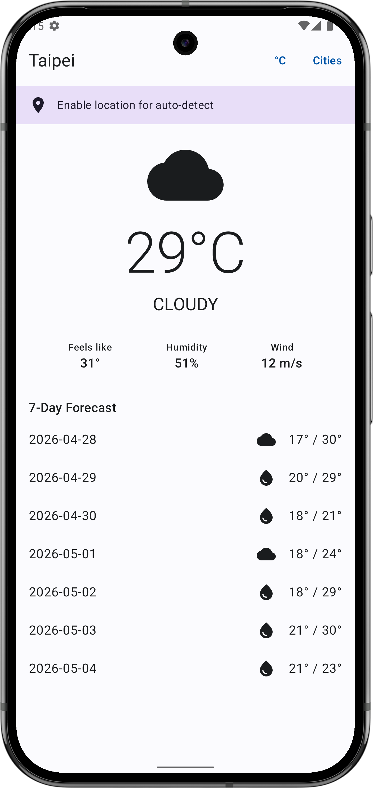

**# Weather Forecast

An Android weather app demonstrating modern Android architecture: Kotlin, Coroutines, Jetpack Compose, Clean Architecture, multi-module Gradle setup, and full SSOT data flow.

## Features

- Current day weather + 7-day forecast
- Multi-city support — search via Open-Meteo geocoding API, save favorites
- Auto-detect current location (with permission)
- Offline support — cached weather displays with stale-data banner
- Toggle between °C / °F
- Pull-to-refresh
- Persistent city selection across app restarts

## Tech Stack

| Layer | Library |
|---|---|
| Language | Kotlin |
| UI | Jetpack Compose, Material 3 |
| Architecture | Clean Architecture (12 modules) + MVVM + UDF |
| DI | Hilt |
| Async | Kotlin Coroutines + Flow |
| Network | Retrofit + kotlinx.serialization |
| Persistence | Room + DataStore Preferences |
| Location | Google Play Services Location + Geocoder |
| Build | Gradle 9 (Kotlin DSL) + AGP 9 + version catalog + convention plugins |
| Testing | JUnit + MockK + Turbine + kotlinx-coroutines-test |

## Quick Start

### Prerequisites

- Android Studio Ladybug or later
- JDK 21
- Android SDK 35
- No API key required — app uses [Open-Meteo](https://open-meteo.com/), which is free and keyless

### Build & Run

```bash
git clone git@github.com:PatrickLin99/weather-forecast.git
cd WeatherForecast
./gradlew :app:installDebug
```

App launches on the connected device or emulator. First launch shows Taipei weather fetched from the network, with a banner suggesting location permission for auto-detection.

### Run Tests

```bash
./gradlew test
```

Expected: 30+ tests, 0 failures.

## Architecture

12 Gradle modules organized by Clean Architecture layers:

```
:app                     ← entry point, NavHost, Hilt setup
:feature:weather         ← weather screen (today + weekly forecast)
:feature:citylist        ← city list, search, selection
:core:domain             ← Repository interfaces + UseCases (the architectural seam)
:core:data               ← Repository implementations (composes all data sources)
:core:network            ← Retrofit + Open-Meteo API + DTOs + mappers
:core:database           ← Room database + entities + DAOs
:core:datastore          ← DataStore Preferences (selected city, temperature unit)
:core:location           ← FusedLocationProvider + Geocoder wrapper
:core:designsystem       ← Material 3 theme + shared Composables
:core:common             ← Result<T,E>, AppError, CoroutineDispatcher qualifiers
:core:model              ← Pure Kotlin domain models (no Android deps)
```

**Dependency direction**: `feature` → `core:domain` (interfaces only) ← `core:data` (implementations). Feature modules never import data sources directly.

**Single Source of Truth**: Room is the SSOT for all UI-observed data. Network calls update Room; the UI observes Room via Flow. Offline reads come from Room; online reads refresh Room, which propagates via the existing Flow.

For full detail: see [`docs/ARCHITECTURE.md`](docs/ARCHITECTURE.md).

## Project Structure

```
WeatherForecast/
├── app/                      ← Entry point
├── core/                     ← Cross-cutting layers
│   ├── common/
│   ├── data/
│   ├── database/
│   ├── datastore/
│   ├── designsystem/
│   ├── domain/
│   ├── location/
│   ├── model/
│   └── network/
├── feature/                  ← Feature modules
│   ├── citylist/
│   └── weather/
├── build-logic/              ← Gradle convention plugins
├── docs/                     ← Project documentation
│   ├── ARCHITECTURE.md
│   ├── CODING_CONVENTIONS.md
│   ├── ERROR_HANDLING.md
│   ├── MODULE_STRUCTURE.md
│   ├── TECH_DEBT.md
│   ├── TECH_DECISIONS.md
│   └── prs/                  ← Per-PR specs and retrospectives
├── gradle/libs.versions.toml ← Version catalog
├── AI_USAGE.md               ← AI collaboration log
└── README.md                 ← You are here
```

## Documentation

| Document | Contents |
|---|---|
| [`docs/ARCHITECTURE.md`](docs/ARCHITECTURE.md) | Layering, dependency direction, SSOT |
| [`docs/MODULE_STRUCTURE.md`](docs/MODULE_STRUCTURE.md) | Per-module package structure |
| [`docs/ERROR_HANDLING.md`](docs/ERROR_HANDLING.md) | `Result<T, AppError>` pattern and `apiCall {}` helper |
| [`docs/CODING_CONVENTIONS.md`](docs/CODING_CONVENTIONS.md) | Naming, Coroutines/Flow conventions |
| [`docs/TECH_DECISIONS.md`](docs/TECH_DECISIONS.md) | Why Open-Meteo, why Room SSOT, key trade-offs |
| [`docs/TECH_DEBT.md`](docs/TECH_DEBT.md) | Known deferred items and resolution log |
| [`AI_USAGE.md`](AI_USAGE.md) | How AI was used in this project |

## API

This app uses [Open-Meteo](https://open-meteo.com/) — free, no API key required.

- Forecast: `https://api.open-meteo.com/v1/forecast`
- Geocoding: `https://geocoding-api.open-meteo.com/v1/search`

## Screenshots

| Weather | City List | Search | Permission |
|---|---|---|---|
|  |  |  |  |**